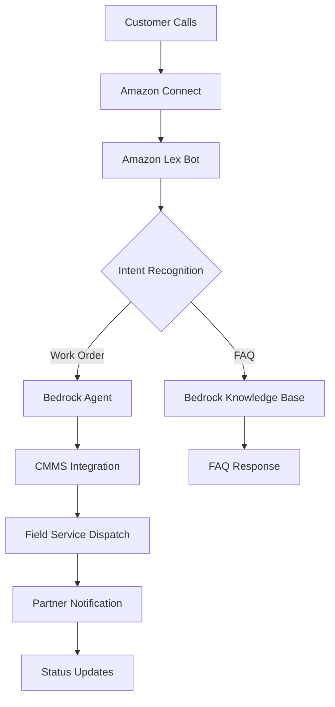
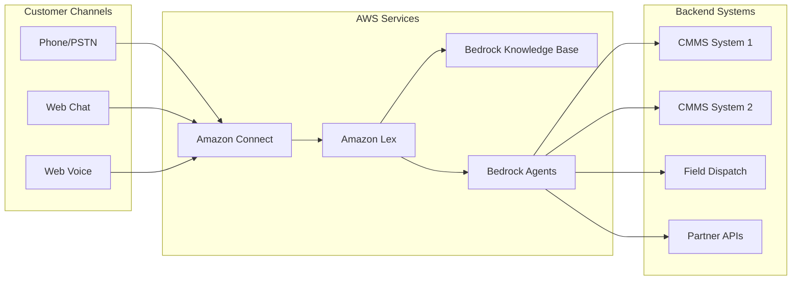

# Design Document

## Overview

The Facility Management Work Order Management Solution presentation is a React-based single-page application that showcases an AI-powered facility management system. The presentation demonstrates how Amazon Connect, Lex, and Bedrock services integrate with existing CMMS systems to automate work order processing through conversational AI.

The application features keyboard navigation, interactive highlighting, dynamic cost calculations, and rich visualizations including Mermaid diagrams for business processes and AWS architecture flows.

## Architecture

### High-Level Architecture

```
┌─────────────────┐    ┌──────────────────┐    ┌─────────────────┐
│   React App     │    │  Slide Manager   │    │  Navigation     │
│   (Main Shell)  │◄──►│  (State Mgmt)    │◄──►│  Controller     │
└─────────────────┘    └──────────────────┘    └─────────────────┘
         │                        │                        │
         ▼                        ▼                        ▼
┌─────────────────┐    ┌──────────────────┐    ┌─────────────────┐
│ Slide Components│    │   Highlighter    │    │  Cost Calculator│
│ (5 Individual)  │    │   Component      │    │   Component     │
└─────────────────┘    └──────────────────┘    └─────────────────┘
```

### Technology Stack

- **Frontend Framework**: React 18+ with functional components and hooks
- **Build Tool**: Bun for fast development and building
- **Styling**: CSS Modules or Styled Components for component-scoped styles
- **Diagrams**: Mermaid.js for business process and Gantt charts
- **Charts**: Chart.js or Recharts for cost visualization
- **State Management**: React Context API for slide navigation and highlighting state

## Components and Interfaces

### Core Components

#### 1. App Component
```typescript
interface AppProps {}

interface AppState {
  currentSlide: number;
  highlightMode: boolean;
  highlights: HighlightData[];
}
```

**Responsibilities:**
- Main application shell
- Global state management
- Keyboard event handling
- Slide routing

#### 2. SlideManager Component
```typescript
interface SlideManagerProps {
  currentSlide: number;
  onSlideChange: (slideNumber: number) => void;
}
```

**Responsibilities:**
- Manages slide transitions
- Handles slide-specific state
- Coordinates with navigation controller

#### 3. NavigationController
```typescript
interface NavigationProps {
  currentSlide: number;
  totalSlides: number;
  onNavigate: (direction: 'next' | 'prev') => void;
}
```

**Responsibilities:**
- Keyboard event processing
- Navigation boundary enforcement
- Slide transition animations

#### 4. VirtualHighlighter Component
```typescript
interface HighlighterProps {
  isActive: boolean;
  onHighlight: (selection: SelectionData) => void;
  highlights: HighlightData[];
}

interface HighlightData {
  id: string;
  slideId: number;
  coordinates: { x: number; y: number; width: number; height: number };
  content: string;
}
```

**Responsibilities:**
- Mouse/touch event handling for highlighting
- Highlight rendering and management
- Selection area calculation

### Slide Components

#### 1. OpeningSlide
```typescript
interface OpeningSlideProps {
  title: string;
  presenter: string;
  date: string;
}
```

#### 2. BusinessProcessSlide
```typescript
interface BusinessProcessSlideProps {
  mermaidDiagram: string;
}
```

#### 3. TechnicalArchitectureSlide
```typescript
interface TechnicalArchitectureSlideProps {
  architectureDiagram: string;
}
```

#### 4. ImplementationPlanSlide
```typescript
interface ImplementationPlanSlideProps {
  ganttChart: string;
}
```

#### 5. CostEstimateSlide
```typescript
interface CostEstimateSlideProps {
  initialCallVolume: number;
  onVolumeChange: (volume: number) => void;
}

interface CostCalculatorProps {
  monthlyCallVolume: number;
  timelineMonths: number;
}
```

#### 6. ClosingSlide
```typescript
interface ClosingSlideProps {
  highlights: string[];
}
```

## Data Models

### Slide Configuration
```typescript
interface SlideConfig {
  id: number;
  title: string;
  component: React.ComponentType;
  props: Record<string, any>;
}

interface PresentationConfig {
  slides: SlideConfig[];
  theme: ThemeConfig;
  navigation: NavigationConfig;
}
```

### Cost Calculation Model
```typescript
interface CostBreakdown {
  amazonConnect: {
    voiceMinutes: number;
    chatMessages: number;
    monthlyCost: number;
  };
  amazonLex: {
    textRequests: number;
    voiceRequests: number;
    monthlyCost: number;
  };
  amazonBedrock: {
    knowledgeBaseQueries: number;
    agentInvocations: number;
    monthlyCost: number;
  };
  totalMonthlyCost: number;
}

interface CostProjection {
  month: number;
  callVolume: number;
  costs: CostBreakdown;
  cumulativeCost: number;
}
```

### Diagram Definitions

#### Business Process Swimlane


#### AWS Architecture Flow


## Error Handling

### Navigation Error Handling
- Prevent navigation beyond slide boundaries
- Handle keyboard event conflicts
- Graceful fallback for unsupported browsers

### Diagram Rendering Error Handling
- Fallback static images for Mermaid rendering failures
- Error boundaries around diagram components
- Loading states for complex diagrams

### Cost Calculator Error Handling
- Input validation for call volume ranges
- Fallback calculations for API failures
- Error messages for invalid inputs

## Testing Strategy

### Component Testing
- Unit tests for individual slide components
- Navigation controller logic testing
- Cost calculation accuracy testing
- Highlight functionality testing

### Integration Testing
- Keyboard navigation flow testing
- Slide transition testing
- Cost calculator integration testing

### Visual Testing
- Diagram rendering verification
- Responsive design testing
- Cross-browser compatibility testing

### Performance Testing
- Slide transition performance
- Large diagram rendering performance
- Memory usage during extended presentations

## Implementation Considerations

### Responsive Design
- Mobile-friendly slide layouts
- Touch gesture support for highlighting
- Adaptive diagram sizing

### Performance Optimization
- Lazy loading of slide components
- Memoization of expensive calculations
- Optimized diagram rendering

### Accessibility
- Keyboard navigation support
- Screen reader compatibility
- High contrast mode support
- Focus management during navigation

### Browser Compatibility
- Modern browser support (Chrome, Firefox, Safari, Edge)
- Graceful degradation for older browsers
- Progressive enhancement approach